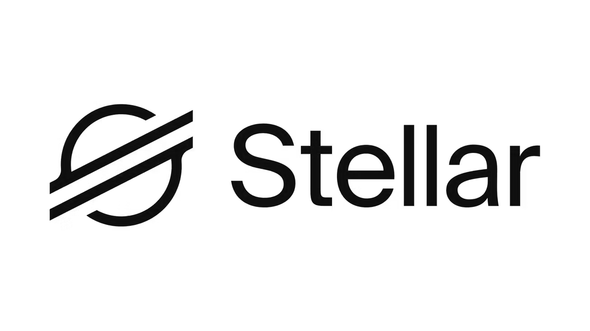

<div align="center">
  

  # Movya Wallet

  **A smart, non-custodial Stellar wallet designed to make crypto payments feel as simple as sending a message.**

  

  <br />

  
  
  
  
</div>

---

## About Movya

Movya helps people interact with digital assets without needing to understand gas fees, complex addresses, or traditional blockchain flows. Its conversational assistant turns a simple instruction into a guided transaction that the user can review and confirm.

> **“Send 20 USDC to Ouali”** → review → confirm → transaction result.

The goal is to build a wallet that feels familiar to everyday users and can become an accessible entry point to Stellar in Latin America.

## Product highlights

- **Conversational payments:** prepare sends directly from the Movya chat.
- **Human-readable contacts:** use saved names instead of repeatedly handling wallet addresses.
- **Stellar portfolio:** view balances, tokens, and recent account activity.
- **Send, receive, and swap flows:** mobile-first experiences with clear confirmations.
- **Guided onboarding:** an interactive demo teaches the core wallet flow.
- **Real Testnet payments:** locally sign and submit XLM and verified-issuer USDC transfers, with balances, history, and transaction receipts.
- **Email accounts and persistent contacts:** Supabase integration with verified email, encrypted Testnet wallet backup, and private contact storage (requires backend configuration).
- **Testnet funding shortcuts:** separate XLM and USDC buttons below the dashboard actions.
- **Responsive premium UI:** optimized for mobile, web, and modern iPhone safe areas.

## Current status

Movya provides an interactive prototype plus a developer wallet that executes real Stellar Testnet payments. Create a Testnet wallet under **Cuenta → Wallet de Testnet**, activate it with Friendbot, and enable USDC before receiving test tokens from Circle.

Native signing uses a locally generated key stored in Expo SecureStore. Configure the Supabase backend to register verified email accounts, store private contacts, and recover the same Testnet wallet using an encrypted backup. Web secrets remain in memory and can be reopened with the account password after reload. Production recovery, sponsorship, and swaps remain pending. The onboarding tutorial is still a simulated demonstration. See [`docs/BACKEND_SETUP.md`](docs/BACKEND_SETUP.md) for activation and current limitations.

## Built with

| Layer | Technology |
| --- | --- |
| Mobile and web | React Native + Expo |
| Navigation | Expo Router |
| Language | TypeScript |
| Network | Stellar Testnet |
| Blockchain data | Horizon API |
| Authentication and database | Supabase Auth + PostgreSQL with RLS |
| Testnet wallet backup | Local AES-256-GCM + PBKDF2; encrypted server storage |
| Local Testnet signing | Stellar SDK + Expo SecureStore (native); memory only (web) |

## Getting started

### Requirements

- Node.js 22.12 or newer (Node.js 24 recommended)
- npm
- Expo Go on a mobile device for native testing

### Installation

```bash
git clone https://github.com/ManuelElias1999/Movya-Wallet-Stellar.git
cd Movya-Wallet-Stellar
npm install
cp .env.example .env
```

### Environment

The app can run with local demo data. To read a real Stellar Testnet account, add its **public key only**:

```bash
EXPO_PUBLIC_DEMO_ACCOUNT=G...
```

Never place a Stellar secret key in an `EXPO_PUBLIC_*` variable or commit one to the repository.

### Run with Expo Go

```bash
npx expo start --go --clear
```

Connect the computer and phone to the same Wi-Fi network, then scan the QR code with Expo Go. If the local connection is unavailable, use:

```bash
npx expo start --go --tunnel --clear
```

### Other commands

```bash
npm run typecheck
npm test
npm run test:testnet
npm run ios
npm run android
npm run web
```

## Guided demo flow

1. With the backend configured, register and verify your email to open the guided onboarding. Without it, select **Continuar con mi wallet de pruebas** to keep testing the existing wallet.
2. Tap the Movya logo in the center of the bottom navigation.
3. Send the message: `Envía 20 USDC a Ouali`.
4. Review the transaction summary.
5. Confirm with **Sí** or cancel with **No**.
6. Movya displays the preparation state, success message, and Stellar explorer link.
7. The onboarding transaction is a visual demonstration and does not move funds.

## Real Testnet transfers

Follow [`docs/TESTNET_PAYMENTS.md`](docs/TESTNET_PAYMENTS.md) to activate a wallet, obtain test USDC, connect Ouali's public address, and send a real payment. When a Testnet wallet is active, chat payment commands open the actual review screen instead of returning a simulated success.

## Project structure

```text
app/                    Expo Router screens and navigation
assets/                 Movya, Stellar, and token images
src/components/         Reusable UI and interaction components
src/config/             Environment configuration
src/data/               Demo portfolio, activity, and contacts
src/hooks/              Stellar account hooks
src/services/stellar/   Horizon service and Stellar types
src/theme/              Shared colors and design tokens
docs/                   Migration and security planning
```

## Roadmap

- Add production account onboarding and recovery.
- Bring the final confirmation and transaction receipt into the conversational assistant.
- Integrate swap liquidity and quotes.
- Add gas sponsorship and web2-friendly onboarding.
- Run user testing in Bolivia and Latin America.

## Documentation

See [`docs/MIGRATION_PLAN.md`](docs/MIGRATION_PLAN.md) for the migration roadmap, security boundaries, and next integration milestones.
See [`docs/TESTNET_PAYMENTS.md`](docs/TESTNET_PAYMENTS.md) for the current payment implementation, testing instructions, and key storage boundaries.
